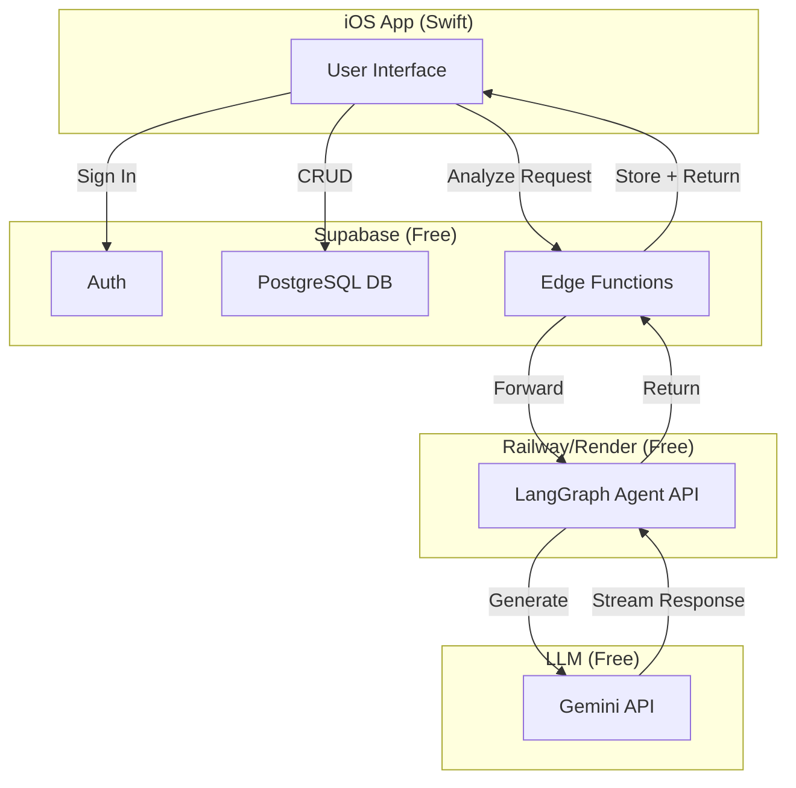
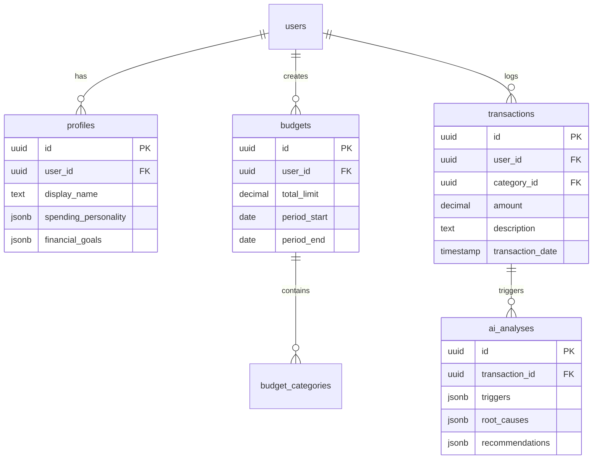

# Axe - System Design Document

> **Budget smarter. Spend better.** A behavioral finance app that addresses the psychological triggers behind impulsive spending, not just the numbers.

## Executive Summary

Axe is a mobile budgeting application with an AI-powered behavioral analysis layer. Unlike traditional budgeting apps that only track spending, Axe helps users understand **why** they overspend by diagnosing psychological triggers and providing personalized intervention strategies.

### Tech Stack (Cost-Optimized)
| Layer | Technology | Cost |
|-------|------------|------|
| **Frontend** | Swift/SwiftUI (iOS) | Free |
| **Backend** | Supabase Free Tier | $0/mo (500MB DB, 1GB storage) |
| **AI Agent** | LangGraph on Railway/Render | Free tier available |
| **LLM API** | Gemini API (generous free tier) | Free (60 req/min) |
| **Distribution** | Apple App Store | $99/year Developer Account |

---

## 1. Free Deployment Options for LangGraph Agent

> [!IMPORTANT]
> Here are the best **free** options to deploy your LangGraph Python agent:

### Option A: Railway (Recommended)
- **Free Tier**: 500 hours/month, 512MB RAM
- **Pros**: Easy deploy from GitHub, supports Python
- **Perfect for**: MVP and testing

```bash
# Deploy flow
1. Push LangGraph code to GitHub repo
2. Connect Railway to repo
3. Railway auto-deploys on push
```

### Option B: Render
- **Free Tier**: 750 hours/month (spins down after inactivity)
- **Pros**: Free PostgreSQL, auto-deploy from GitHub
- **Cons**: Cold starts after 15min inactivity

### Option C: Vercel (Serverless Functions)
- **Free Tier**: 100GB bandwidth, 100k function invocations
- **Best for**: If you wrap LangGraph in FastAPI

### Option D: Google Cloud Run (Free Tier)
- **Free Tier**: 2M requests/month, 180k vCPU-seconds
- **Pros**: Generous, no cold start issues
- **Setup**: Deploy via Docker container

### LLM API (Free)
| Provider | Free Tier | Best For |
|----------|-----------|----------|
| **Google Gemini** | 60 req/min, unlimited for Gemini Flash | Recommended! |
| **OpenAI** | $5 free credits (expires) | Testing |
| **Groq** | 30 req/min, Llama/Mixtral | Fast inference |

---

## 2. Supabase Free Tier Limits

Your Supabase Free plan includes:
| Resource | Limit |
|----------|-------|
| Database | 500MB |
| Storage | 1GB |
| Auth Users | 50,000 |
| Edge Function Invocations | 500k/month |
| Realtime Connections | 200 concurrent |

> [!TIP]
> This is plenty for MVP and early users. You'll only need to upgrade when you have significant traction.

---

## 3. App Store Deployment Requirements

### 3.1 Apple Developer Account
- **Cost**: $99/year
- **Required for**: TestFlight, App Store submission
- **Sign up**: [developer.apple.com](https://developer.apple.com)

### 3.2 App Store Checklist
- [ ] App icons (all sizes via Asset Catalog)
- [ ] App Store screenshots (6.5", 5.5", iPad)
- [ ] Privacy Policy URL (required)
- [ ] App description, keywords, categories
- [ ] In-App Purchase setup (StoreKit 2) for subscriptions
- [ ] App Review Guidelines compliance

### 3.3 In-App Purchases (Subscriptions)
Apple takes **15-30%** of subscription revenue:
| Duration | Apple's Cut |
|----------|-------------|
| Year 1 | 30% |
| Year 2+ (same subscriber) | 15% |

---

## 4. Recommended Architecture Flow



---

## 5. Core Features & Modules

### 5.1 User Authentication & Onboarding
- **Email/Password** + **Apple Sign-In** via Supabase Auth
- **Onboarding flow**: Financial goals + spending personality assessment

### 5.2 Budgeting Core
- Manual transaction entry (bank sync deferred to Phase 2)
- Budget categories with limits
- Spending analytics (charts, trends)

### 5.3 AI Behavioral Analysis Agent
| Capability | Description |
|------------|-------------|
| **Trigger Detection** | Identifies emotional triggers (stress, boredom, FOMO) |
| **Root Cause Analysis** | Diagnoses underlying psychological reasons |
| **Recommendations** | Personalized intervention strategies |

---

## 6. Database Schema (Supabase)



---

## 7. Implementation Phases

### Phase 1: Core MVP (Free Stack)
- [ ] Supabase project + database schema
- [ ] Auth (Email + Apple Sign-In)
- [ ] Onboarding flow
- [ ] Manual transaction logging
- [ ] Budget creation/tracking
- [ ] LangGraph agent on Railway + Gemini API
- [ ] TestFlight deployment

### Phase 2: Launch
- [ ] App Store submission
- [ ] Subscription system (StoreKit 2)
- [ ] Advanced AI insights history
- [ ] Push notifications

### Phase 3: Scale
- [ ] Plaid bank sync integration
- [ ] Upgrade Supabase as needed
- [ ] Android version consideration

---

## 8. Cost Summary

### MVP Phase (Months 1-3)
| Item | Cost |
|------|------|
| Supabase | $0 |
| Railway (LangGraph) | $0 |
| Gemini API | $0 |
| Apple Developer | $99/year |
| **Total** | **$99/year** |

### After Scale
- Supabase Pro: $25/mo (when you need it)
- Railway: $5/mo (when exceeding free tier)
- Gemini API: Pay-as-you-go (very cheap)

---

## 9. Questions to Confirm

1. **LLM Choice**: Use Gemini (free) or prefer OpenAI/Claude?
2. **Free tier limit**: 5 AI analyses/month for free users?
3. **Subscription pricing**: $9.99/mo for Premium?
4. **Phase 1 focus**: Core budgeting + AI, defer subscriptions?
